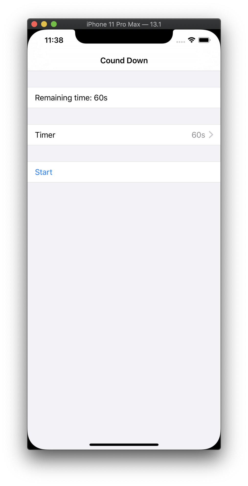
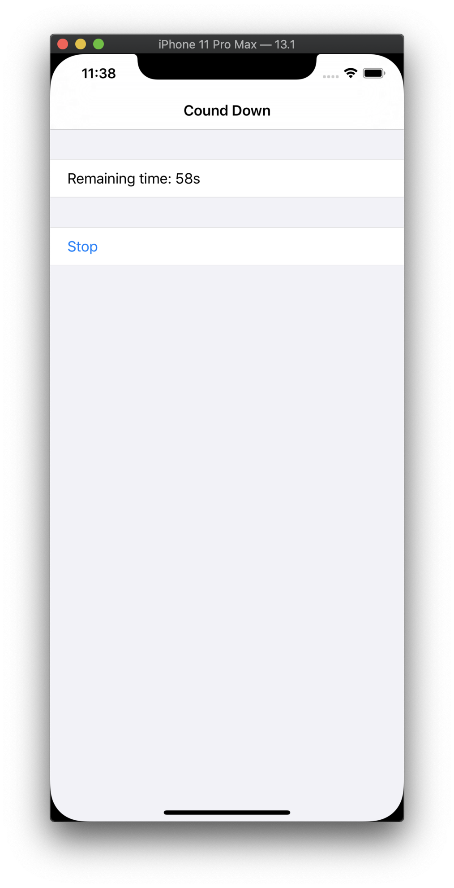
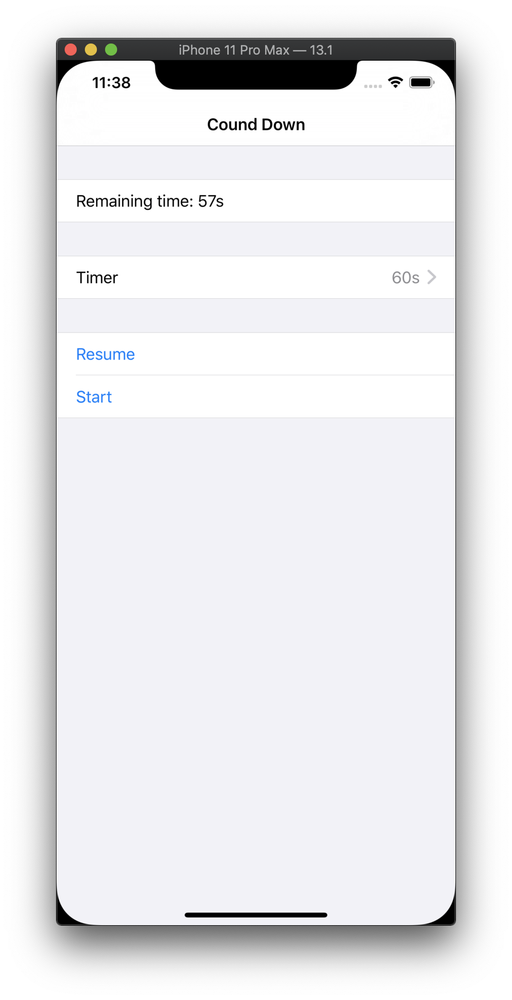
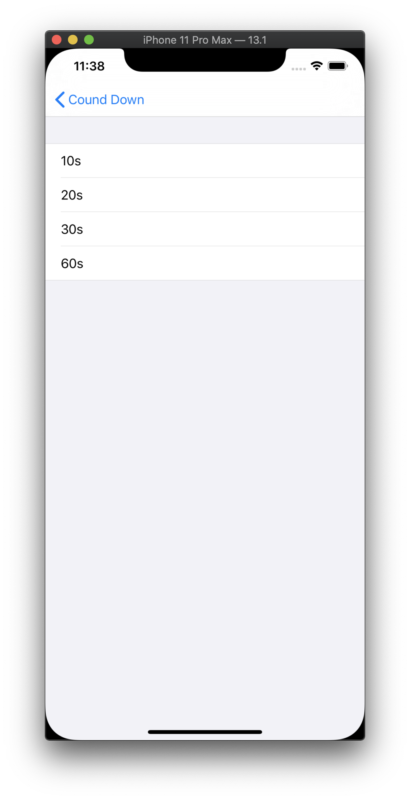

Timer Sample
====
This is simple timer using [CombineTimer](https://github.com/masa7351/CombineTimer).

## Demo

|initial|running|pause|setTime|
|:----|:----|:----|:----|
|||||

## Requirements & Support
- Xcode 11.1
- iOS 13.0 over

## Licence

[MIT](https://github.com/masa7351/setupHelper/blob/master/LICENSE)

## Author

[masa7351](https://github.com/masa7351)
